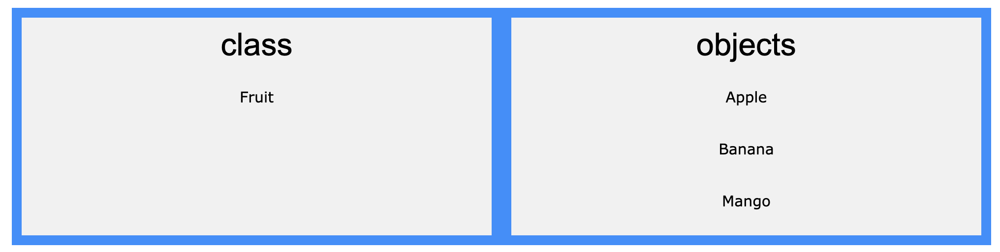
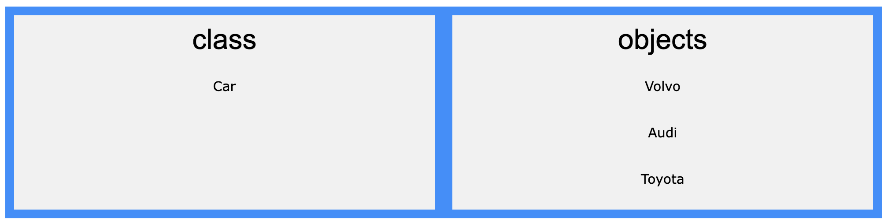

# OOP
## What's OOP?
OOP stands for Object-Oriented Programming.

Procedural programming is about writing procedures or methods that perform operations on the data, while object-oriented programming is about creating objects that contain both data and methods.

Object-oriented programming has several advantages over procedural programming:

- OOP is faster and easier to execute
- OOP provides a clear structure for the programs
- OOP helps to keep the Java code DRY "Don't Repeat Yourself", and makes the code easier to maintain, modify and debug
- OOP makes it possible to create full reusable applications with less code and shorter development time
- Tip: The "Don't Repeat Yourself" (DRY) principle is about reducing the repetition of code. You should extract out the codes that are common for the application, and place them at a single place and reuse them instead of repeating it.

## Classes and Objects

Java is an object-oriented programming language. 

Everything in Java is associated with classes and objects, along with its attributes and methods. 

For example: in real life, a car is an object. The car has attributes, such as weight and color, and methods, such as drive and brake.

A Class is like an object constructor, or a "blueprint" for creating objects.
  ### Class
   <strong>A class is a template for objects.</strong>

  **Definition**
   A blueprint for objects. Defines a datatype by bundling data and methods.

  **Contents**
  Can include fields (variables), methods (functions), constructors, blocks, nested classes, and interfaces.
  
  **Example**:  
  A `Car` class might have fields like `colour`, `brand`, and methods like `drive()` and `brake()`.

  

  

  ### Object
  <strong>An object is an `instance` of a class.</strong> 

  When the individual objects are created, they `inherit` all the variables and methods from the class.

  **Definition**: An instance of a class, created using the `new` keyword.

  **Characteristics**: Possesses its own state (attributes) and behaviour (methods).
  
  **Example**: Creating a `Car` object (`Car myCar = new Car();`) means `myCar` has attributes (like color, brand) and behaviours (methods).

## Local Variables vs Instance Variables
### Local Variables
- `Defined within methods or blocks.`
- Accessible only within the defining method or block.
- Exist only during the execution of the method or block they are defined in.
- Destroyed once the method completes or the block is exited.
### Instance Variables / Object Member Variables
- `Defined inside a class but outside any methods.`
- Accessible from any method within the class, and potentially from outside the class depending on access modifiers.
- Their life cycle is tied to the life of the object instance.
- They are destroyed when the object is destroyed or becomes eligible for garbage collection.
